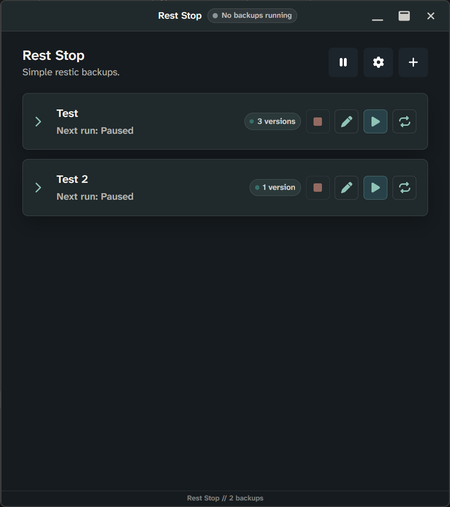
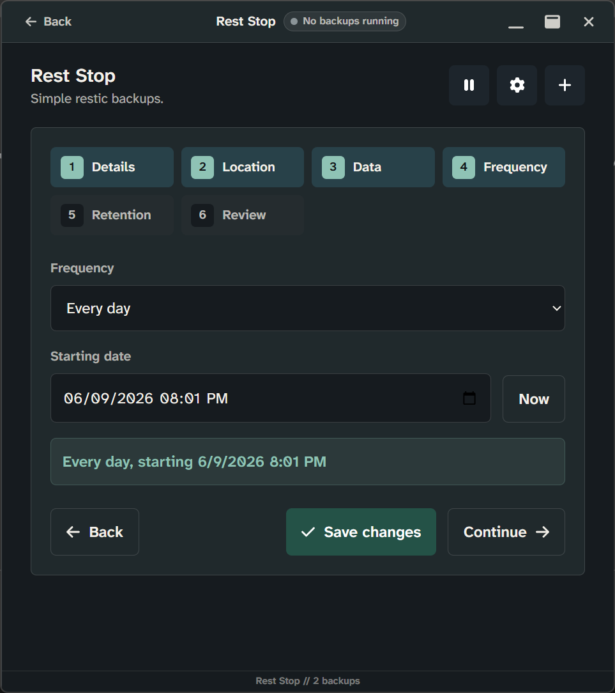
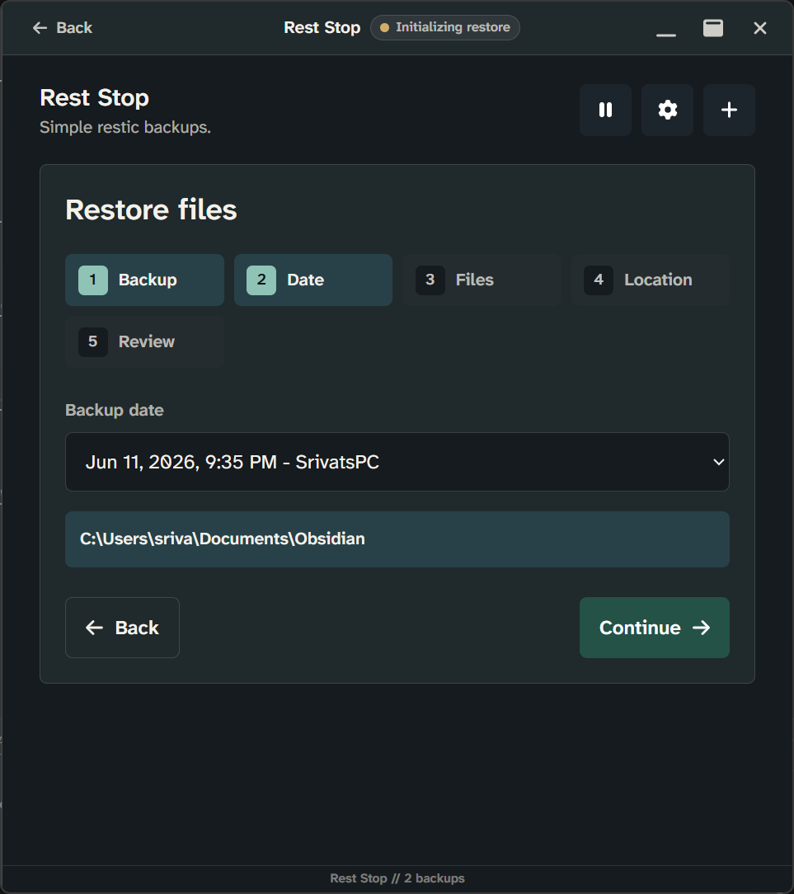
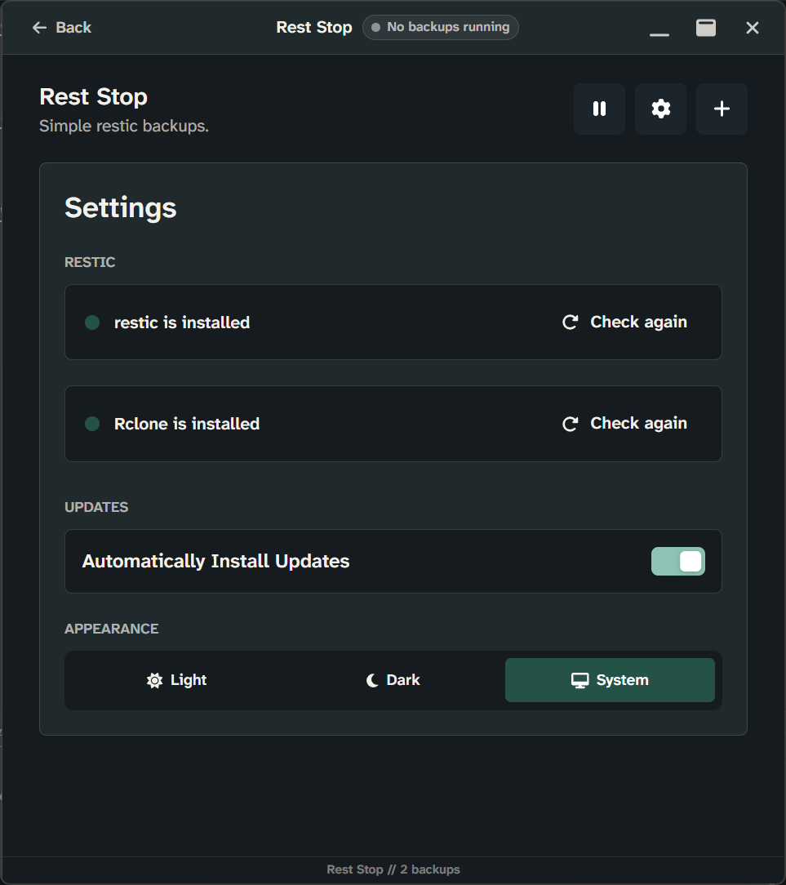
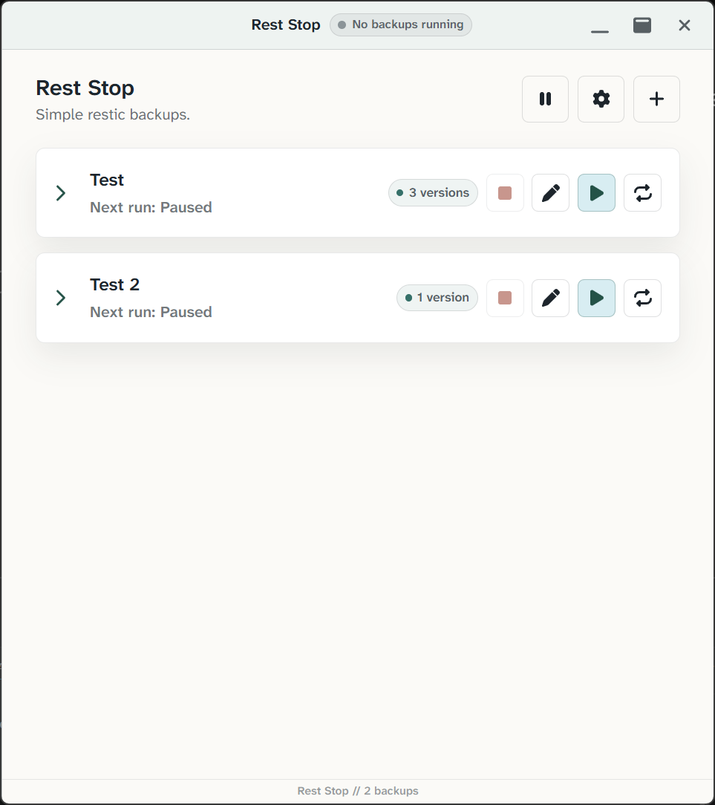
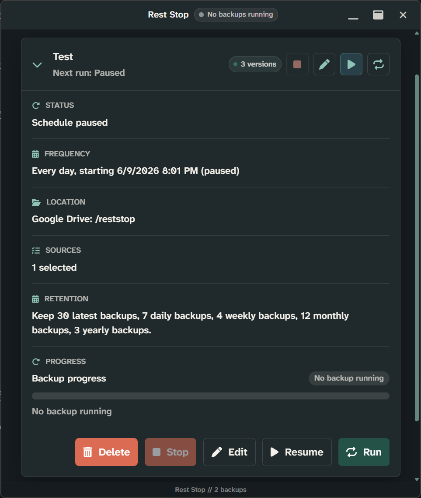

# Rest Stop

Simple restic backups.

<p align="center">
  
</p>

<p align="center">
  <a href="https://github.com/srivatsshankar/rest-stop/actions/workflows/tests.yml"></a>
  <a href="https://github.com/srivatsshankar/rest-stop/releases"></a>
</p>

<p align="center">
  
</p>

Rest Stop is a lightweight desktop app for creating, managing, and restoring restic backups without using the command line.

## Features

- Create restic backup profiles with clear step-by-step setup.
- Restore from saved profiles or manual backup locations.
- Choose local folders, SMB paths, SFTP, REST, and Rclone-backed repositories.
- Store and reuse backup passwords through Electron secure storage.
- Run backups on demand or by saved recurring schedules.
- Keep scheduled backups running from the system tray after the window is closed.
- Start automatically when the installed app launches at login.
- Show backup and restore activity in the taskbar and system tray.
- Surface backup and restore failures with persistent error details.


## Downloads

Download the installer that applies to your system from the [Rest Stop releases page](https://github.com/srivatsshankar/rest-stop/releases).

## Previews

### Backup Creation

Shows the guided flow for creating a new restic backup profile.



### Restoration Example

Shows the restore workflow for selecting a backup and restoring files.



### Settings Menu

Shows the application settings, including tool checks, appearance, and update preferences.



### Light Mode

Shows the application light mode.



### Collapsible Menu

Shows the collapsible menu providing details of each backup.



### Taskbar

Shows the taskbar status indicator used to reflect idle, running, and failed backup or restore activity. The application is minimized to the taskbar.

<p align="center">
  
</p>

## Development

### Local Setup

Install dependencies:

```bash
npm install
```

Run the app in development:

```bash
npm run dev
```

Run tests:

```bash
npm test
```

Build the installer:

```bash
npm run dist
```

### App Icon

Drop a square PNG at:

```text
public/app-icon/icon.png
```

Running `npm run dev`, `npm run build`, or `npm run dist` generates the native icon formats used by the app.

### Publishing Releases

Use the version in `package.json`, commit the release, then run:

```bat
release-github.bat
```

The script pushes a `vX.Y.Z` tag, which triggers GitHub Actions to publish the Windows installer and update metadata.
