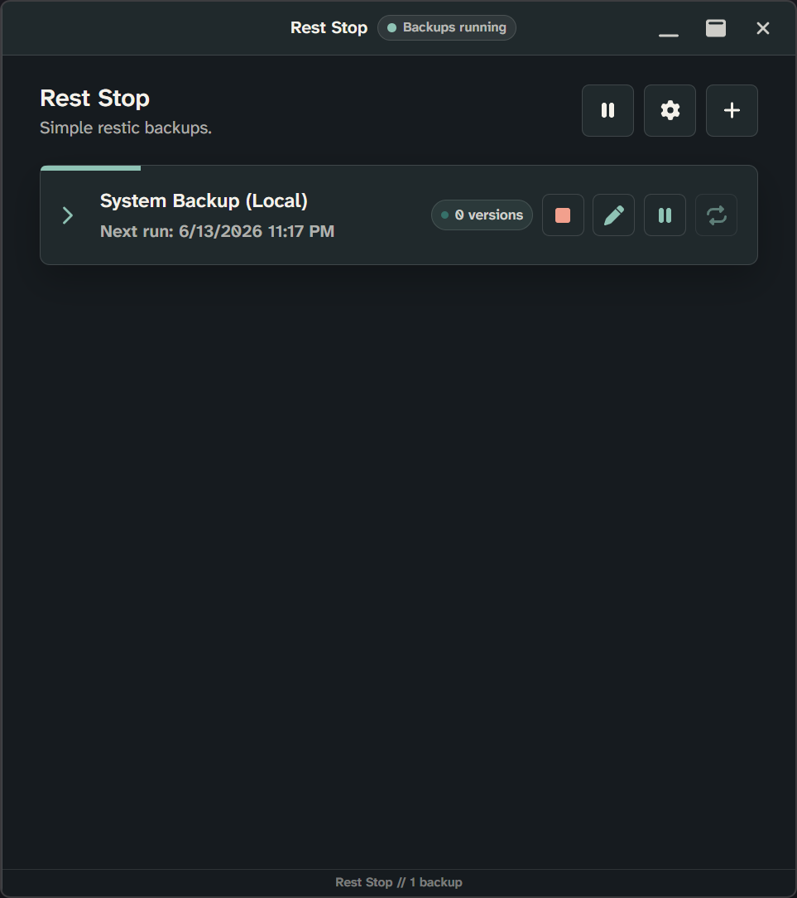

# Rest Stop

Simple restic backups.

<p align="center">
  
</p>

<p align="center">
  <a href="https://github.com/srivatsshankar/rest-stop/actions/workflows/tests.yml"></a>
  <a href="https://github.com/srivatsshankar/rest-stop/releases"></a>
</p>

<p align="center">
  
</p>

Rest Stop is a lightweight desktop app for creating, managing, and restoring restic backups without using the command line.

## Features

- Create restic backup profiles with clear step-by-step setup.
- Restore from saved profiles or manual backup locations.
- Choose local folders, SMB network folders, SFTP, REST, and Rclone-backed repositories.
- Store and reuse backup passwords through Electron secure storage.
- Run backups on demand or by saved recurring schedules.
- Keep scheduled backups running from the system tray after the window is closed.
- Start automatically when the installed app launches at login.
- Show backup and restore activity in the taskbar and system tray.
- Surface backup and restore failures with persistent error details.
- Exclude common extensions and expressions


## Backend Options

Rest Stop can create and restore restic repositories in these locations:

| Backend | Setup |
| --- | --- |
| Local folder | Direct folder picker for a local disk, external drive, or mounted path. |
| SMB network folder | Direct network folder path. |
| REST server | Restic REST repository URL. |
| SFTP server | Restic SFTP repository URL. |
| Google Drive | Rclone OAuth connection. |
| OneDrive | Rclone OAuth connection. |
| Dropbox | Rclone OAuth connection. |
| Box | Rclone OAuth connection. |
| pCloud | Rclone OAuth connection. |
| Yandex Disk | Rclone OAuth connection. |
| MEGA | Rclone credentials. |
| Backblaze B2 | Rclone application key credentials. |
| S3 | Rclone S3-compatible credentials. |
| SMB / CIFS | Rclone SMB/CIFS credentials. |

## Downloads

Download the installer that applies to your system from the [Rest Stop releases page](https://github.com/srivatsshankar/rest-stop/releases).

> Note: Rest Stop is currently available on **Windows**. _Linux and MacOS versions are under development._

## Previews

### Backup Creation

Shows the guided flow for creating a new restic backup profile.


### Restoration Example

Shows the restore workflow for selecting a backup and restoring files.


### Settings Menu

Shows the application settings, including tool checks, appearance, and update preferences.


### Light Mode

Shows the application light mode.


### Collapsible Menu

Shows the collapsible menu providing details of each backup.


### Progress Bar

Shows the progress of a backup.



### Taskbar

Shows the taskbar status indicator used to reflect idle, running, and failed backup or restore activity. The application is minimized to the taskbar.

<p align="center">
  
</p>

## Development

### Local Setup

Install dependencies:

```bash
npm install
```

Run the app in development:

```bash
npm run dev
```

Run tests:

```bash
npm test
```

Build the installer:

```bash
npm run dist
```

### App Icon

Drop a square PNG at:

```text
public/app-icon/icon.png
```

Running `npm run dev`, `npm run build`, or `npm run dist` generates the native icon formats used by the app.

### Publishing Releases

Use the version in `package.json`, commit the release, then prepare the tag and release notes:

```bat
release-prepare.bat
```

Fill in `md/releases/vX.Y.Z.md` with the features, fixes, and maintenance notes for the release. When the notes are ready, publish the release:

```bat
release-github.bat
```

The publish script overwrites the `vX.Y.Z` tag and removes an existing GitHub release if needed. GitHub Actions then builds the Windows `.exe` files, creates the release as a draft with the markdown file as the release body, attaches the installers, and publishes the release only after the files are attached.

## Credits

Third-party library and tool notices are listed in [Credits.md](Credits.md).
